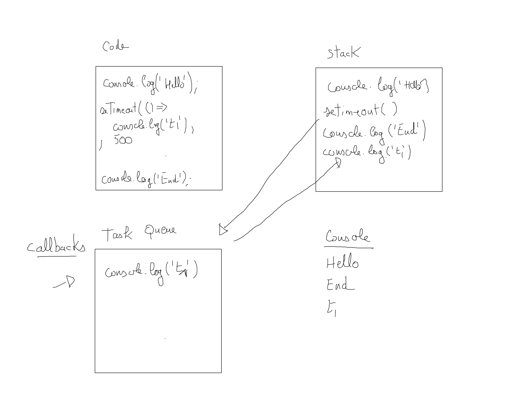
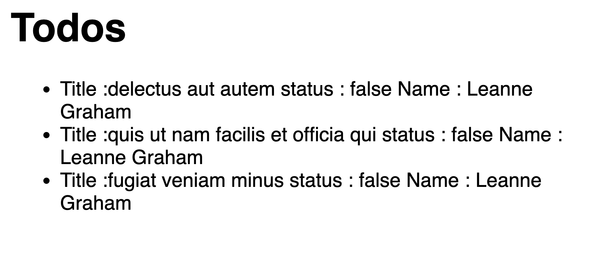

# Asynchrone en JS

## Introduction

Exécution du code de manière différée. Il permet également de gérer des actions qui "normalement" sont bloquantes. Chaque ligne est exécutée de manière synchrone, si une fonction prend du temps à s'exécuter le code synchrone attend la fin de son exécution.

**JavaScript est synchrone et mono-thread**. Il n'y a qu'un seul fil d'exécution, stack, du code source, chaque ligne est exécutée de manière synchrone. Par contre les lignes asynchrones sont placées dans une file d'exécution (Task Queue). Toutes les fonctions asynchrones seront alors exécutées les unes à la suite des autres par l'Event Loop. Elles seront alors envoyées dans la stack d'exécution principale sans bloquer le reste du programme.

Ce mécanisme constitue le coeur de JS.

Il n'y a pas de parallèlisme en JS, tout est géré dans le même thread.



Par exemple, lorsque vous faites une requête sur une API, vous pouvez fournir à une fonction asynchrone une fonction de callback qui sera exécutée dans la stack d'éxecution une fois la réponse consommée, sans bloquer le reste du code.

Remarques : il peut y avoir plusieurs Task Queue, par exemple le navigateur peut **prioriser** certaines actions asynchrones. Par défaut dans une Task Queue les callbacks sont en mode FIFO (first in first out ou premier entrée premier exécuté).


## Exemple de code synchrone

```js

cons synchroneFunc = () => {
    console.log("Start function");
}

console.log("Start");
synchroneFunc();
console.log("End");
```

## Exemples de code asynchrone 

```js
console.log('Start');

setTimeout(() => console.log('Hello world !'), 1000);

console.log('End');
```

## 01 Exercice login callback

Soit le programme asynchrone login suivant. Que vaut à votre avis la variable email dans le script ? Répondez sans exécuter le code.

```js

const login = (email, password ) => {
    setTimeout(() => {
        return { email };
    }, 1000);
}

const email = login('alan@alan.fr', 1234567890);
console.log(email);

```

Ajoutez une fonction de callback afin de récupérer la valeur de l'email une fois l'utilisateur "connecté".

```js
const login = (email, password, callback ) => {
    setTimeout(() => {
        // ...
    }, 1000);
}
```

## 02 Exercice additions callback

1. En utilisant deux fois la fonction add qui est asynchrone et avec sa fonction de callback additionner 1 et 2 

```js
const add = (number, callback) => {
    setTimeout(() => {
        //
    }, 1000);
}
```

Ajoutez maintenant une fonction de callback **error**. Cette fonction sera appelée uniquement lorsqu'une valeur passée en paramètre n'est pas un nombre.

2. Améliorez la fonction d'erreur en levant une exception.

```js

throw new Error('Bad number ...')

```

### 03 Exercice concat async

Soit une fonction message asynchrone qui retournera une chaîne de caractères. Appellez deux fois cette fonction pour concatener le message suivant : "Hello" + "World!".

## Promesse

La gestion de l'asynchrone peut devenir très vite complexe si on utilise systématiquement des fonctions de callback (callback hell).

Nous allons maintenant aborder une autre approche native au JS : les Promesses. Elles simplifient l'utilisation des méthodes asynchrones.

Une promesse a un **état initial** en attente : **pending**. Une fois **résolue** elle est dans **l'état settled** et dans ce cas son état ne change plus.

- La méthode **then** est une méthode qui sera appelée après le succès de la promesse; en cas d'échec la méthode **catch** sera appelée.

### Exemple de promesse

```js
const p = number => ( new Promise((resolve, reject) => {
    setTimeout(() => {
        if(number > 100) {
            reject(new Error('To big'));
            return;
        }
        resolve(number);
    }, 300);
    })
);

p(9)
.then( num => console.log(num))
.catch( err => console.error(err))

```

Remarque : vous pouvez enchaîner plusieurs promesses, elles seront résolues l'une à la suite de l'autre.

## 04 Exercice add avec des promesses

Reprenez l'exercice précédent avec la fonction **add** mais cette fois-ci utilisez des promesses.

## Promise all

Vous pouvez également lancer plusieurs promesses en même temps. Elles seront avec la méthode all toutes résolues. Si l'une d'entre elles échoue tout s'arrêtera.

```js
const p = number => ( new Promise((resolve, reject) => {
  setTimeout(() => {
    if (isNaN(parseInt(number))) {
        reject( new Error( 'not a number ...' ) );

        return;
    }
    resolve(number);
  }
  , 100);
}) ) ;

Promise.all([p(1), p(2), p(3)]).then(numbers => { 
    console.log( numbers.reduce((acc, curr) => acc + curr) );
}).catch( err => console.error(err));

```

### 05 Exercice read json dragon

Vous allez utiliser un module node "fs" qui permet de lire un fichier. 

Récupérez le fichier data/dragons.json sur le serveur et testez le code ci-dessous :

```js
const fs = require('fs');

fs.readFile('./data/dragons.json', { encoding: 'utf8' }, (err, data) => {
    // impossible de lire le fichier
    if (err) {
        console.log("File read failed:", err);
        return;
    }
    // success
    // JSON.parse permet de transformer un fichier JSON en un objet JSON JS
    console.log('File data:', JSON.parse(data)) 
})
```

1. Changez le code ci-dessus et utilisez une **promesse** pour gérer la récupération des données au format JSON Object dans JS.

2. Quel est le nom du dragon le plus agé ? Faite un script pour répondre à cette question.

3. Quel est le nom du dragon le plus jeune ? Faite un script pour répondre à cette question.

4. Récupérez les dragons et ordonnez les par age décroissant.


## Async await

L'opérateur **await** permet d'attendre la résolution d'une promesse. Il ne peut être utilisé qu'à l'intérieur d'une fonction **async**. L'intérêt c'est d'avoir une **logique "synchrone"** sur une partie de code asynchrone.

```js
async function process(){
    try{
        let sum = 0;
        const res1 = await add(1); // attendre la résolution de la promesse
        sum+=res1;
        const res2 = await add(3);
        sum+=res2;
        const res3 = await add(5);
        sum+=res3;

        console.log(sum);
    // si vous lancez une exception à partir de la promesse
    // dans le cas où celle-ci est échoue
    // vous capturez l'exception dans le bloc suivant 
    }catch( err ){
        console.error(err);
    }
}
```

Une fonction async/await peut également retourner une valeur, dans ce cas vous traiterez son retour comme une promesse à l'aide du mot réservé then.

```js
async function process() {
    let sum = 0;
    const res1 = await add(1); 
    sum+= res1;
    const res2 = await add(2); 
    sum+= res2;

    return sum;
}

process()
    .then( sum => console.log(sum))
    .catch(err => console.error(err));
```

### Exercice anim

Soit la Promesse anim, elle retournera une valeur aléatoire composée d'un chiffre de 1 à 9 et d'une lettre comprise entre A et X. 

Executez 10 fois ce générateur pour construire une chaîne aléatoire en utilisant la technique async/await décrite ci-dessus.

### Exercice fibonacci async

Reprenez l'exercice précédent et utilisez l'async/await pour calculer les valeurs de la suite de Fibonacci.

### Exercice fetch 

Nous allons utiliser fetch dans un fichier JS en installant un module Node :

```bash
npm install node-fetch
```

1. Utilisez fetch pour récupérer les utilisateurs. Vous enregistrerez les noms et coordonnées GPS dans une structure de données.

2. Enregistrez ces données dans un fichier à part en utilisant le module fs.

```js

fetch( 'https://jsonplaceholder.typicode.com/users' )
    .then( res => res.json())
    .then( res => console.log(res))
```

## Exercice async/await TODOS

Dans un fichier todos, vous créez un fichier index.html avec le code suivant :

```html
<!DOCTYPE html>
<html lang="en">

<head>
    <meta charset="UTF-8">
    <meta name="viewport" content="width=device-width, initial-scale=1.0">
    <link rel="shortcut icon" href="">
    <title>Exercice 1 : Nombre de caractères</title>
    <style>
        html {
            font-family: sans-serif;
        }

        body {
            width: 50%;
            max-width: 800px;
            min-width: 480px;
            margin: 0 auto;
        }

        .result {
            color: white;
            padding: 3px;
        }
    </style>
</head>

<body>
    <h1>Todos</h1>
    <ul id="todos">
    </ul>
    <script>
    
    </script>
</body>

</html>
```

A l'aide de l'API fetch du navigateur, récupérez les 3 premiers résultats en simulant un délai entre chaque valeur de 500ms.

```txt
https://jsonplaceholder.typicode.com/todos
```

Vous afficherez le titre du todo ainsi que son statut.

- Reprendre l'exercice précédent en utilisant async/await.

```js

const request = async () => {

    const response = await // ... 
}

```

Affichez maintenant le premier todo et le nom du user associé (voir la clé userId).

```js
https://jsonplaceholder.typicode.com/users/1
```


